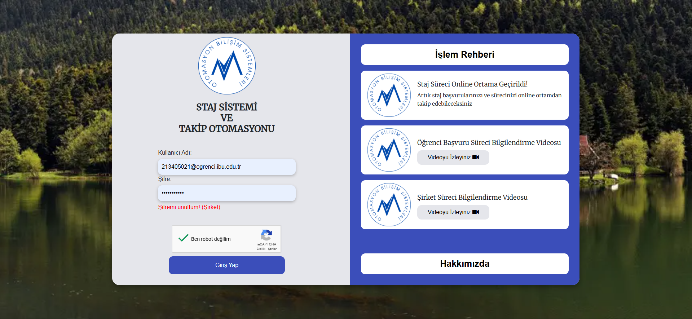

# 🎓 Staj ve Arıza Takip Otomasyon Sistemi

Bu proje, üniversite bünyesinde hem **staj sürecini dijital olarak yönetmek** hem de **kampüs içi arıza bildirimlerinin takibini sağlamak** amacıyla geliştirilmiş iki modüllü tam kapsamlı bir web uygulamasıdır.

Bu proje, **Abant İzzet Baysal Üniversitesi Bilgisayar Mühendisliği** bölümü öğrencilerinin staj başvurularını dijital ortamda yönetmelerini ve üniversite personelinin karşılaştığı arızaları kolaylıkla bildirmelerini sağlamak amacıyla geliştirilmiştir. Tüm sistem tek bir repository'de barındırılmakta olup, aşağıda detaylı olarak **iki ana bölüm** ayrı ayrı açıklanmıştır.

Ben ise bu projede C# ve MSSQL kullanarak sistem için backend servisleri geliştirdim ve uygulamanın veri tabanının oluşturulmasına ve geliştirilmesine katkı sağladım.

---

## 📁 Proje Yapısı

- **Staj Sistemi ve Takip Otomasyonu**
- **Arıza Takip Sistemi**

---

## 🧩 1. Staj Sistemi ve Takip Otomasyonu

### 🎯 Amaç

Öğrencilerin staj başvuru süreçlerini baştan sona dijital ortamda gerçekleştirmesini sağlamak ve bu süreci bölüm başkanından, şirket yetkilisine ve fakülte yönetimine kadar adım adım takip edilebilir hale getirmek.

### 🔄 İşleyiş Akışı

1. **Öğrenci Başvurusu:**

   - Öğrenci sisteme giriş yapar.
   - Kendi fotoğrafını ve stajla ilgili belgeleri (belge yükleme alanları ile) sisteme yükler.
   - Staj tarihlerini ve gerekli bilgileri girer.
   - Staj başvurusunu başlatır.

2. **Bölüm Başkanının Onayı:**

   - Öğrencinin tüm bilgileri ve yüklediği belgeler incelenir.
   - Onay verilirse, sistem otomatik olarak ilgili **şirket e-posta adresine** bir davet maili gönderir.

3. **Şirket Onayı:**

   - Mail üzerinden gelen bağlantı ile sisteme kayıt olan şirket yetkilisi, öğrenci bilgilerini inceler ve onay verir.

4. **Staj Komisyonu & Fakülte Sekreteri & Bölüm Sekreteri Onayı:**

   - Sırasıyla tüm bu akademik/administratif birimler sisteme giriş yaparak başvuruyu değerlendirir ve onaylar.

5. **PDF Oluşturma:**

   - Her adımda, başvuruya ait çıktı alınabilir bir **PDF belgesi** oluşturulabilir. Belgeler, resmi forma uygun şekilde otomatik doldurulur.

6. **Mail Bildirimleri:**

   - Her geçiş adımı (örneğin bölüm başkanı onayladı → şirket onayı bekleniyor) **e-posta bildirimleriyle** ilgili taraflara iletilir.

7. **Admin Paneli**:
   - Yetkili kullanıcılar ve şirketler admin tarafından yönetilir.

### 📎 Özellikler

- Çok adımlı onay süreci
- Otomatik mail gönderimi ve davet sistemi
- Gerçek zamanlı durum takibi
- PDF çıktısı alma
- Kullanıcı rollerine özel dashboardlar (öğrenci, şirket, yönetici)

---

## 🧩 2. Arıza Takip Sistemi

### 🎯 Amaç

Üniversite yerleşkesinde öğrenciler, akademik personel ve idari çalışanlar tarafından gözlemlenen fiziksel arızaların (sınıf ekipmanı, altyapı vb.) sisteme bildirilerek, bu arızaların yetkili personel tarafından giderilmesini sağlamak.

### 🔄 İşleyiş Akışı

1. **Arıza Talebi Oluşturma:**

   - Her kullanıcı (öğrenci, akademisyen, vs.) sisteme giriş yaparak gördüğü bir arızayı:
     - Konum
     - Açıklama
     - Tarih
       gibi bilgileri girerek bildirir.

2. **Fakülte Sekreterliği İncelemesi:**

   - Talep, ilgili fakülte sekreterine iletilir.
   - Sekreter, sistemde kayıtlı **personellerden birine** bu arızayı atayabilir.

3. **Personelin Müdahalesi:**
   - Atama alan personel, kendisine atanan arızaları sistemden görüntüler.
   - Arızayı çözdükten sonra sistemden **tamamlandı olarak işaretler**.

### 📎 Özellikler

- Herkesin arıza bildirebilmesi (giriş yeterlidir)
- Fakülte bazlı sekreter – personel eşleştirmesi
- Görev atama sistemi
- Arıza durumu takibi (açık → atandı → tamamlandı)

---

## 🛠️ Kullanılan Teknolojiler

- **Backend**: C# (MVC Mimarisi)
- **Veritabanı**: MSSQL (İlişkisel Veritabanı)
- **Frontend**: HTML, CSS, JavaScript, Bootstrap
- **Mail Bildirimleri**: SMTP

---

## 🧑‍💻 Geliştirici Bilgisi

Bu projenin **Backend geliştiricisi** olarak sistemin tüm veri işlemleri, kullanıcı rollerinin tanımı, e-posta bildirim sistemi, PDF çıktıları ve onay mekanizmalarının arka plan kodlamaları geliştirilmiştir.

---

## 🏫 Canlı Kullanım Bilgisi

Proje, **2024 yaz dönemi** itibariyle **Abant İzzet Baysal Üniversitesi Bilgisayar Mühendisliği Bölümü**'nde aktif olarak kullanıma alınmıştır ve **halen staj süreçleri bu sistem üzerinden yürütülmektedir.**

---

Canlı Proje: 
Projenin Videoları: 

---

## 🖼️ Ekran Görüntüleri

## Giriş Ekranı

Ziyaretçilere sistemin işleyişi, özellikleri ve avantajları hakkında genel bir tanıtım sunar. Kullanıcıyı yönlendiren birinci temas noktasıdır.İşletmeleri keşfetme, paketleri inceleme ve sisteme giriş yapma seçeneklerini sunar.

